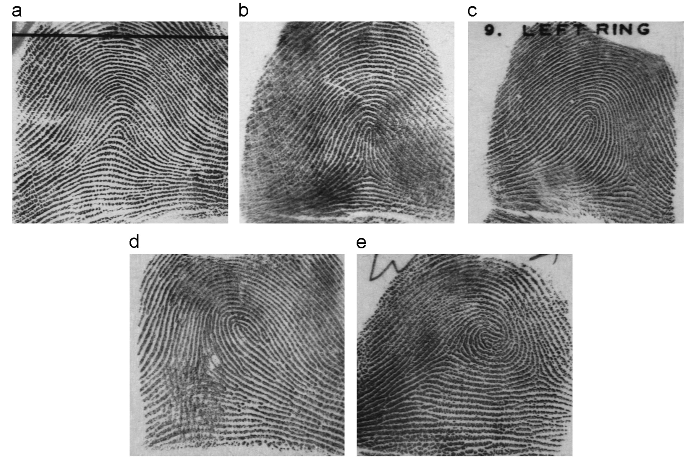
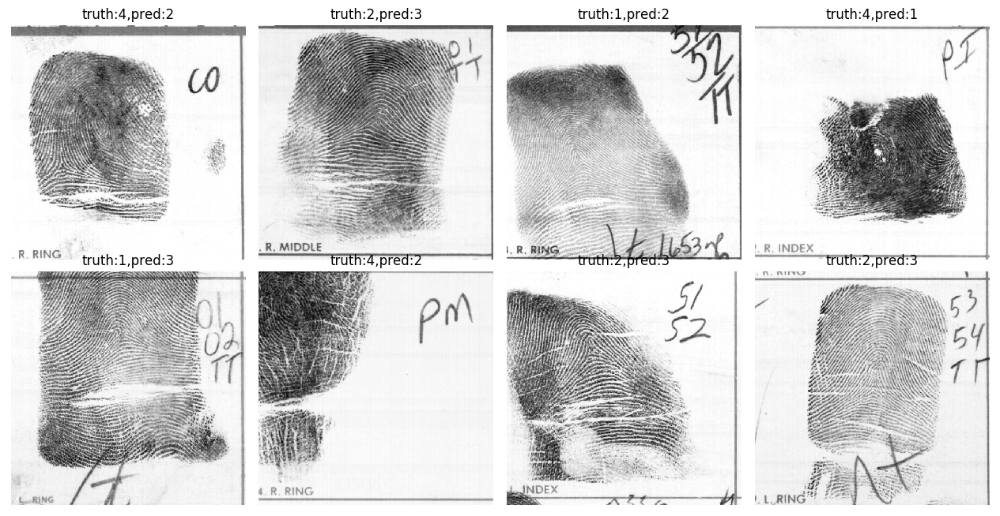

## Welcome to GitHub Pages

You can use the [editor on GitHub](https://github.com/zengxiao1028/CSE902_Project_17Spring/edit/master/README.md) to maintain and preview the content for your website in Markdown files.


## CS902_PROJECT 2017SPRING



This project aims to classify a fingerprint into one of the following type:
(a) Arch (b) Tented Arch (c) Left Loop (d) Right Loop (e) Whorl.

### Background

Fingerprints are ridge and valley patterns presented on the surface of human fingertips.

Fingerprints are used to recognize humans for applications such as verifying an identity claim (i.e., one-to-one search to  unlock a smartphone, for example), or identification (i.e., one-to-many search to find a suspect of a crime, for instance).

Typically, to query a fingerprint, the system needs to search and compare the query print with the fingerprints stored in a reference (or enrolled) database.  The size of a reference database can be from thousands to hundreds of millions subjects, depending on the application. For example, the Aaddhar project in India has enrolled 111,98,29,743 persons as of February 18.  
As the size of the database grows, the number of comparisons to be made for identification purposes grow, so does the computation time.

To mitigate this problem, most fingerprint recognition algorithms first classify a fingerprint into a basic pattern type and then perform fingerprint matching within fingerprints of that type.

The major five fingerprint pattern types used today are an extension of the three pattern types (whorl, loop, and Arch) introduced by Henry Faulds (Henry classification system) and Sir Francis Galton} in late 19th century. 

Because arch and tented arch only accounts for a small portion (around 6\%) in human, some automatic fingerprint identification systems combine these two classes into one class.

### Related Work
Previous work mostly consists of singularity points (core and delta) detection or extracting features such as ridge and orientation flow, or using human markups (or handcrafted features) as the basis for pattern type classification. 

Therefore, the accuracy of these methods depends on the goodness (or utility) of the selected features and the precision of the feature extraction portion of the algorithms. Both are sensitive to the noise and the variations of the gray-scale level of the input image.  

Using handcrafted features can improve performance.  However, in addition to being burdensome and time consuming, accuracy of handcrafted features cannot be guaranteed due to the existence of noise and poor image quality. 

Moreover, their repeatability and reproducibility cannot be guaranteed either, due to inter- and intra-examiners variations.  

### Progress

The network we use consists of 8 convolutional layers and 2 fully-connected layer. The last layer is a fully-connected layer with 5 neurons, corresponding to 5 fingerprint classes. Dropout is used in the first fully-connected layer with 0.5 dropout rate. The optimized is Adam.

We use data augmentation techniques (random contrast, brightness adjustion, rotation, translation)

dataset: NIST Special Database 14(https://www.nist.gov/srd/nist-special-database-14). Totally 2700 subjects, 54000 samples.

80% samples are used for training. 20% are used for testing.
After training for 80K steps, the top-1 accuracy is 97%.

Some failure cases are shown below:


Full projecct description can be found at [Link](https://github.com/zengxiao1028/CSE902_Project_17Spring/blob/master/proposal/main.pdf)

```
# Header 1
## Header 2
### Header 3

- Bulleted
- List

1. Numbered
2. List

**Bold** and _Italic_ and `Code` text

[Link](url) and 


For more details see [GitHub Flavored Markdown](https://guides.github.com/features/mastering-markdown/).

### Jekyll Themes

Your Pages site will use the layout and styles from the Jekyll theme you have selected in your [repository settings](https://github.com/zengxiao1028/CSE902_Project_17Spring/settings). The name of this theme is saved in the Jekyll `_config.yml` configuration file.

### Support or Contact

Having trouble with Pages? Check out our [documentation](https://help.github.com/categories/github-pages-basics/) or [contact support](https://github.com/contact) and we’ll help you sort it out.
